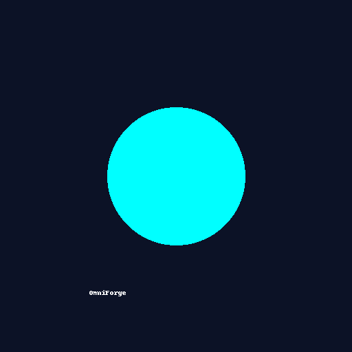

<p align="center">
  
</p>

<p align="center">
  <a href="#"></a>
  <a href="#"></a>
  <a href="#"></a>
  <a href="#"></a>
</p>


# OmniForge ULTRA 🌌

**The ultimate multiverse infrastructure orchestrator.**  
Built with Go. CLI + REST + gRPC. Modular. Secure. OSS-Ready.

## ✨ Key Features
- Multiverse infrastructure engine (Roblox, Unity, Unreal)
- CLI, REST, and gRPC interfaces
- Real config parsing (.json, .yaml)
- Adapters architecture with mocks and plugins
- CI/CD, Docker, Tests, GitHub Actions
- Security hardened (JWT, input validation)
- Fully documented (Swagger + Godoc)
- Ethical, accessible, inclusive

## 🚀 Quickstart
```bash
git clone https://github.com/omniforge/omniforge.git
cd omniforge
go build -o omniforge ./cmd/omniforge
./omniforge init
```
